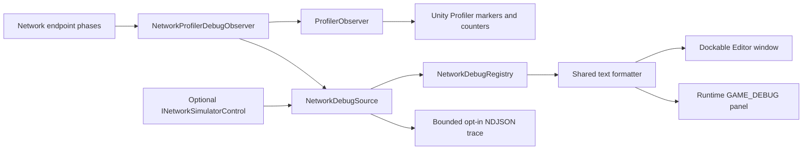

# Static ECS Network Profiler

Privacy-safe Unity Profiler instrumentation and shared runtime/Editor diagnostics for Network v4.

## Capabilities

- Exposes `Receive`, `Decode`, `CommandDispatch`, `SnapshotApply`, `SnapshotCapture`, and `Send` markers in the Network category.
- Reports measured nanosecond phase duration as marker metadata and dedicated duration counters.
- Reports process-wide traffic, outcome deltas, connection state, snapshot, history, and tick-gap gauges.
- Publishes bounded immutable debug snapshots through `NetworkDebugRegistry` and `NetworkDebugSource`.
- Provides shared `NetworkDebugPage` and `NetworkDebugTextFormatter` contracts for runtime and Editor interfaces.
- Publishes payload-free `NetworkTransportDebugData` through an optional lazy provider and renders a Transport page.
- Provides a dockable UI Toolkit window for overview, session, snapshot, command, traffic, schema, trace, and optional mock-simulator inspection/control.
- Keeps payload bytes, command values, ECS handles, entity data, and user identifiers out of diagnostics.

## Usage

Use `ProfilerObserver` when only Unity Profiler markers and counters are needed:

```csharp
var observer = new ProfilerObserver(source: 1);
var client = new NetworkClient<GameWorld>(transport, schema, scope, observer);
var server = new NetworkServer<GameWorld>(schema, scopeSelector, observer: observer);
```

The observer implements `INetworkObserver` and remains caller-owned. Network endpoints do not dispose it.

Register a detailed endpoint diagnostics source and pass it as the endpoint observer:

```csharp
var lease = NetworkDebugRegistry.RegisterWithProfiler(
    "client-main",
    "Client Main",
    schema.Entries,
    out var diagnostics,
    worldName: typeof(GameWorld).Name,
    simulator: optionalSimulator,
    transport: optionalTransportDiagnostics);

var client = new NetworkClient<GameWorld>(transport, schema, scope, diagnostics);
```



Keep the returned lease with the endpoint lifetime and dispose it during shutdown. Open
`Game > Static ECS > Network Debug` to inspect registered sources in the Editor. Host and
Debug Client builds expose the same sources through the shared runtime panel. Live pause stops display
refresh only; endpoint diagnostics continue. Trace collection can be disabled or cleared,
and retained trace rows can be exported as strict payload-free NDJSON.

When a source supplies `INetworkSimulatorControl`, the `Simulator` tab exposes preset,
seed, latency, jitter, loss, duplicate, reorder, bandwidth, connect/disconnect, delivery
pause, reset, and bounded decision record/replay. Client Main and Embedded Server may point
to the same capability and therefore show the same link. A Dedicated Server source normally
has no simulator capability and its controls remain disabled. Registry reset and source
leases never reset or dispose the caller-owned simulator.

The observer stream, clocks, and endpoint flow are documented in the cross-package
[network architecture guide](../../../docs/guides/network-static-ecs.md).

## Configuration

- Required: reference `unigame.staticecs.network.profiler` from the endpoint assembly.
- Required for Unity Profiler telemetry: pass a `ProfilerObserver` to each endpoint whose trace stream should be sampled.
- Required for either diagnostics UI: register a unique stable source id and dispose its lease during endpoint shutdown.
- Optional: configure per-source trace and history capacities; defaults are 512 trace rows and 128 session/snapshot rows. Trace retention is opt-in and starts disabled.
- Optional: supply a bounded world display name at registration; it is metadata only and never retains a world or ECS handle.
- Optional: supply a caller-owned `INetworkSimulatorControl`. `NetworkDebugData` copies its
  configuration, counters, and payload-free decision timeline before publishing a snapshot.
- Optional: supply a lazy `Func<NetworkTransportDebugData>` provider. The provider is evaluated
  only by `Capture`; missing, throwing, or unavailable providers publish `HasTransport == false`.
- Optional: assign a privacy-safe numeric profiler `source` lane. Do not derive it from peers, epochs, schema fingerprints, or payload data.
- Delta counters emit positive totals. Gauge counters retain the latest value and flush at the end of the Unity frame.
- Receive owns inbound transport totals; the next ordered Decode attributes that retained delta to its validated packet kind. Pending and overflowed rows remain visible under `None`.
- `Cycle` is mock or replay transport ordering, while network diagnostics use `ServerTick`; neither Unity frame nor Static ECS tracking tick is presented as authoritative simulation time.

## Limitations

- Runtime and Editor interfaces cannot mutate ECS entities or session internals; they may control only an explicitly registered mock simulator capability. Trace file export remains Editor-only.
- Trace and history are process-local bounded diagnostics, not a persistent capture service.
- Detailed records intentionally omit payload bytes, command values, ECS handles, and Unity object references.
- Receive-to-Decode attribution assumes the endpoint's synchronous ordered pipeline; asynchronous decode requires correlation metadata.
