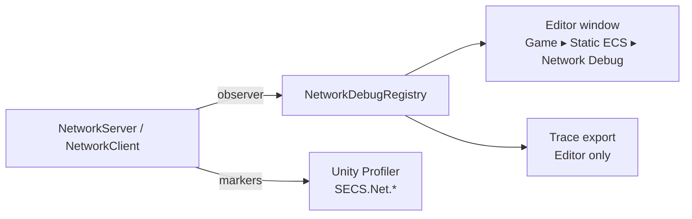

# Static ECS Network Profiler

Privacy-safe Unity Profiler instrumentation and bounded diagnostics for network protocol
v10. It never records payload bytes, command values, ECS handles, entity data or user identifiers.

## Data flow



## Server tick markers

| Marker | Measures |
|---|---|
| `SECS.Net.ServerTick` | Whole network tick |
| `SECS.Net.Command`, `SECS.Net.OwnerLookup` | Command decode, validation and apply |
| `SECS.Net.Snapshot` | Capture, delta choice and send for all peers |
| `SECS.Net.SnapshotCapture` | Capture call only (per scope) |
| `SECS.Net.SnapshotDeltaEncode` | Delta encode on a cache miss |
| `SECS.Net.PacketPreparation`, `SECS.Net.SnapshotChunkEncode`, `SECS.Net.TransportTrySend` | Per-peer framing and send |
| `SECS.Net.NativeUpdate`, `SECS.Net.ReceiveCallback` | Transport poll/flush and receive |
| `SECS.Net.ReliableDrain` | Adapter reliable FIFO drain |

The package also has counters: bytes and packets in and out, active peers, history ticks and
bytes, resyncs, protocol and schema errors.

## Usage

```csharp
using var registration = NetworkDebugRegistry.RegisterWithProfiler(
    "client-main", "Client Main", schema.Entries, out var observer,
    worldName: typeof(ClientWorld).Name);

var client = new NetworkClient<ClientWorld>(transport, schema, scope, observer);
```

- Reference `unigame.staticecs.network.profiler` from the endpoint assembly and pass the
  returned observer to the endpoint.
- Keep the registration for the endpoint lifetime and dispose it on shutdown.
- Default capacities: 512 trace rows, 128 history rows. Trace retention is opt-in.
- Simulator controls stay caller-owned; diagnostics never mutate ECS or session state.
